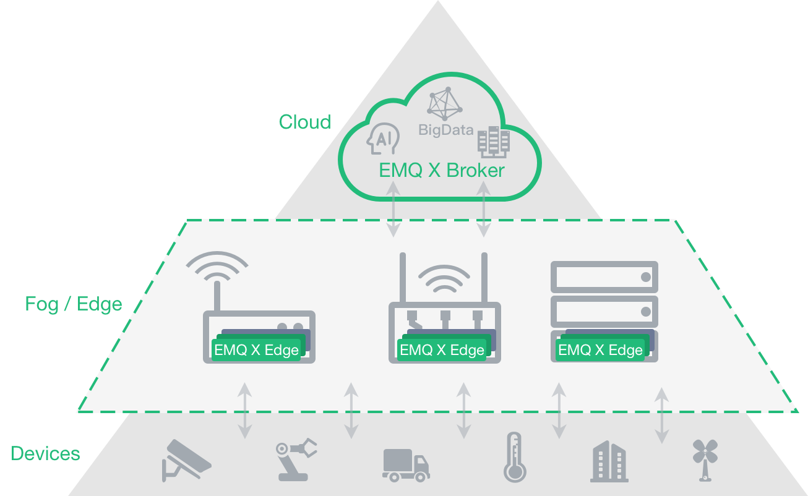

# EMQ X Edge Message Server

## Introduction

EMQ X Edge is an open source, lightweight MQTT broker running at any resource-constrained edge devices.

EMQ X Edge is fully open source and licensed under the Apache Version 2.0. EMQ X implements both MQTT V3.1/V3.1.1 and V5.0 protocol specifications, and supports MQTT, TCP, WebSocket and different industry protocols such ModBus.

EMQ X Edge can be running at different kinds of resource constrained edge devices, such as Raspberry Pi, gateway and industrial servers. And as the bridge between the local terminals and the remote broker, EMQ X Edge provides local data processing and cloud synchronization which will automatically synchronize data with cloud service based on network status.

## Installation

Download link: [https://www.emqx.io/downloads/emq/edge](https://www.emqx.io/downloads/emq/edge)

Document link: [https://developer.emqx.io/docs/edge/v3/cn/](https://developer.emqx.io/docs/edge/v3/cn/)

