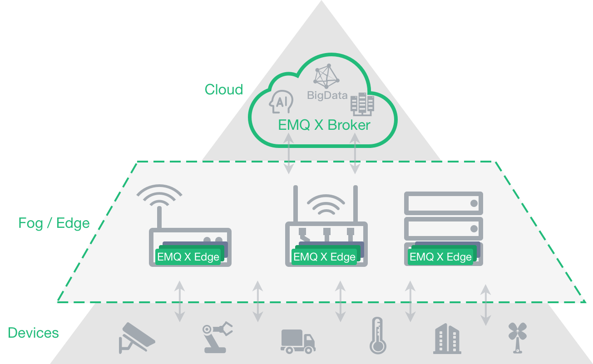

# EMQ X Edge Message Server

## Introduction

*EMQ X Edge* is a lightweight open source message server that runs at resource-constrained edge devices. It is a bridge between the cloud and the local device. As a message proxy running on the edge computing node in the IoT platform system,  it can process most of the data locally on the edge node by using the business rule engine. It can also respond to the request of device in real time. An encrypted transport protocol is used between the EMQ X edge node and EMQ X server processing cluster in the backstage. If the connection between the Edge node and the remote EMQ is disconnected due to a transmission network problem, the Edge node automatically saves the specified message to the local storage. When the network is normal, the data will be sent automatically to the remote EMQ X cluster and other MQTT message servers.

*EMQ X Edge* fully supports the MQTT V3.1/V3.1.1/V5.0 version protocol specification and supports industrial protocols such as MQTT-SN, TCP, WebSocket, CoAP, Stomp, and Modbus.

## Installation

Download link: [https://www.emqx.io/downloads/edge?osType=Raspberry%20Pi](https://www.emqx.io/downloads/edge?osType=Raspberry%20Pi)

Document link: [https://developer.emqx.io/docs/edge/v3/cn/](https://developer.emqx.io/docs/edge/v3/cn/)
