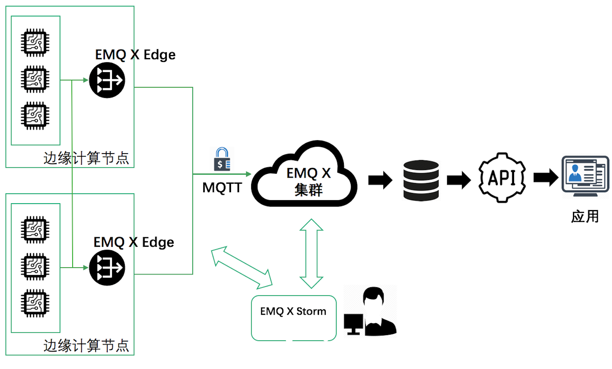

# Edge Computing Management Platform- Storm

## Introduction

EMQ X Storm (hereafter referred to as the Storm platform) is a management platform for EMQ X Edge  message server to solve the following problems:

1. When a large number of  edge message servers are deployed with geographically dispersed location and a relatively complex space environment, It is difficult to perform operation and maintenance management tasks such as obtaining monitoring server status and running indicators, changing related function configurations, and firmware upgrades.
2. When the calculation rules such as device access, message routing data processing and data transparent transmission on the edge node may need to be changed with the service operation, a rule management and distribution platform is required to implement the editing, version control, and release of the calculation rules.

EMQ X Storm centralizes the monitoring management of edge nodes and supports the above requirements through the Web interface and the management monitoring REST API.

**Online operation:** [https://storm.emqx.io](https://storm.emqx.io)

**Github（Not open source at present, used for issues feedback and requirement release）:** [https://github.com/emqx/storm](https://github.com/emqx/storm)

