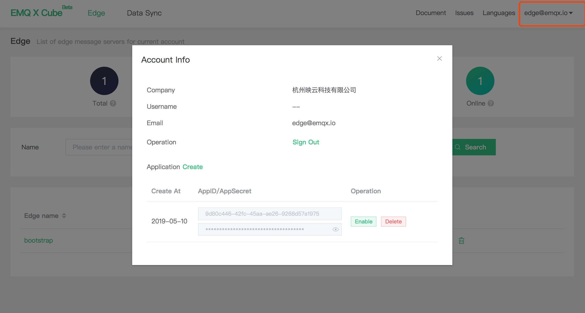

# Account and login

Cube platform uses  [EMQ account](https://www.emqx.io/account) for authentication login, which requires binding mailbox for registration before using.

Under the login state, the user can click the registered  mailbox at upper right corner to view the current account information, manage the REST API key or perform the logout operation.

