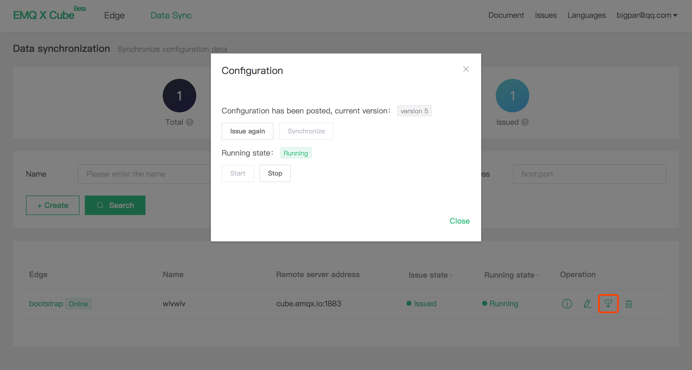

# Data synchronization management

Data synchronization is used to configure data synchronization rules and issue the configuration to the edge message server.

The data synchronization list under the current account can be viewed through data synchronization home page:

- Total: The number of data synchronizations created under the current account
- Issued number: The number of data synchronization configurations that have been issued to the Edge

The data synchronization configuration can be issued only when the Edge is online. The issued state includes the following:

- Not issued: The new data synchronization configurations are not issued  after creation.
- Issued: Issued successfully and the Edge configuration is the same as the configuration saved by Cube.
- Updates not issued: Data synchronization rules have been changed on Cube but not issued, which  is inconsistent with that of Edge
- Fail to issue. The configuration fails to issue due to network and parameter configuration.

Data synchronization will start up and run  on the Edge side immediately after it was successfully issued . The running state is as follows:

- Not running: Data synchronization has never been run
- Running: Under normal operation
- Pause running: Manual/fault leads to pause running, and Edge-related data synchronization will actively refresh  the running state of Cube after failure recovery.

## Issue panel

Click the **issue icon** in the table operation bar  to pop-up issue control panel to issue the selected data synchronization configuration.

- Issue status: The current running status (issued/not issued/updates not issued) and the current configuration version are displayed. The version will increase by 1 each time when the configuration is changed.

- Issue button：
  - Issue: Issue to the Edge for the first time.

   - Issue again: If the configuration on the Edge side does not exist, create and start the configuration. If it exists, update and restart the configuration. Use it with caution.
   - Sync: Available when the version on the Cube is leading, and update the latest configuration to the Edge side.

 - Running control:

   - Start: Start current configuration
   - Stop: Stop current configuration

