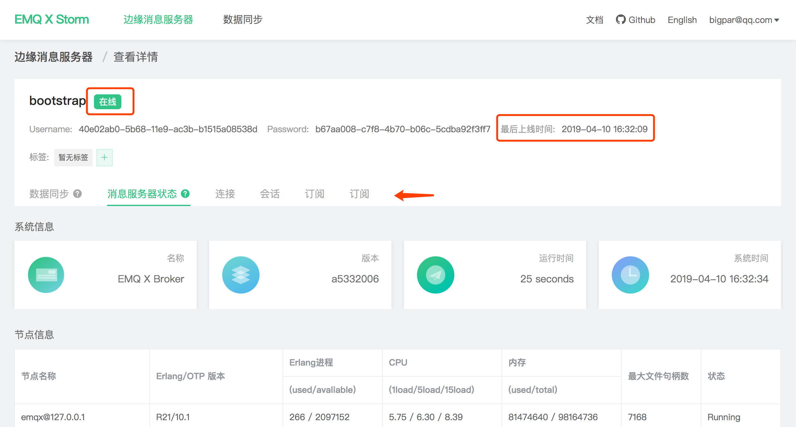

# Quick connect

EMQ X Edge connects to the Storm platform and manages command communication through the [emqx-storm ](http://github.com/emqx/emqx-storm) plugin. The preconditions for the operations are as follows:

- The network environment in which the Edge is located can establish a communication connection with [storm.emqx.io:1883](tcp://storm.emqx.io:1883) 
- The version of emqx-edge  is greater than or equal to v3.1-rc.2
- Register [EMQ Account](https://www.emqx.io/account)  and create a new Edge Message Server in [Storm](https://storm.emqx.io) 
- Configure the Edge emqx-storm plugin and start Edge

> Note: It will not affect the normal use of other Edge features without the connection of storm.


## Configuring Connection information

After creating a new edge message server, the connection information can be viewed in Edge Message Server **Details**:


Open the Edge emqx-storm plugin configuration file `etc/plugins/emqx_storm.conf` and modify the following items:

```bash
# Storm 接入地址，默认 storm.emqx.io:1883
storm.address = storm.emqx.io:1883

# 认证用户名，使用详情中的 Username 信息
storm.username = 40e02ab0-5b68-11e9-ac3b-b1515a08538d

# 认证密码，使用详情中的 Password 信息
storm.password = b67aa008-c7f8-4b70-b06c-5cdba92f3ff7
```


## Start the Edge Message Server

After the Edge starts successfully, it will automatically establish a connection with Storm. At this time, the relevant server status in Storm will be set to **Online**. Click the relevant Tab page to get the corresponding running indicator.




At this point, you have successfully connected the Edge to Storm.