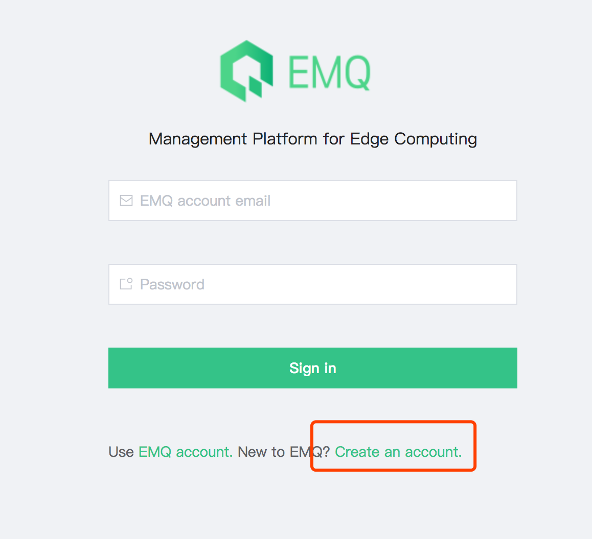

# Quick Start

EMQ X Edge connects to Storm platform through  [emqx-storm](http://github.com/emqx/emqx-storm)  plug-in and communicates management instructions. The steps of enabling preparation and operation are as follows:

1. The emqx-edge version is greater than or equal to v3.1-rc.3 [click to download](https://www.emqx.io/downloads/emq/edge?OsType=Raspberry%20Pi#download)

2. Edge's network environment can establish communication links with [storm.emqx.io:1883](storm.emqx.io:1883)

3. Register [EMQ account](https://www.emqx.io/account?Tab=register) and create a new edge message server in [Storm](https://storm.emqx.io)

4. Fill in the configuration in Storm on Edge and start the emqx-storm plug-in

> Note: It will not affect the normal use of other Edge features without the connection of storm.


## Registration and Login


[Storm Open Platform](https://storm.emqx.io) uses [EMQ Account](https://www.emqx.io/account?Tab=register) to authenticate login. If you have not registered with the EMQ official website, please go to the registration activation.




## Create edge


On the **Edge Message Server** page, click the New button to type in the server name and description to create the Edge Message Server.


## Get the startup configuration


When a new Edge Message Server is created, the information needed to access Storm can be obtained from the Edge Message Server **Details Page**:


Open the Edge emqx-storm plug-in configuration file `etc/plugins/emqx_storm.conf`, with the following modifications:

```bash
# Storm connection adress，default storm.emqx.io:1883
storm.address = storm.emqx.io:1883

# Authentication username, Username information in the usage details
storm.username = 40e02ab0-5b68-11e9-ac3b-b1515a08538d

# Authentication password, password information in the usage details
storm.password = b67aa008-c7f8-4b70-b06c-5cdba92f3ff7
```


## Start and connect


If the configuration is correct, Edge will automatically establish a connection with Storm after successful start-up. At this time, the state of the relevant server in Storm will be set to **online**. Click on the relevant Tab page to get the corresponding operation indicators.


So far, you have successfully accessed Edge to Storm.


