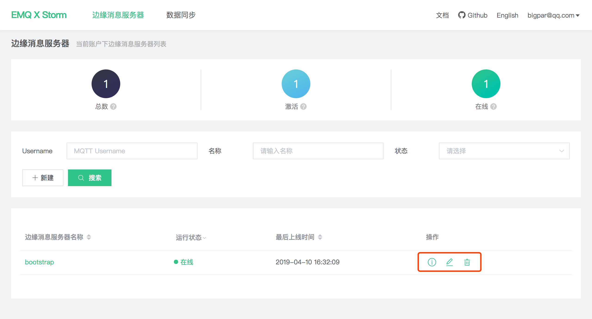
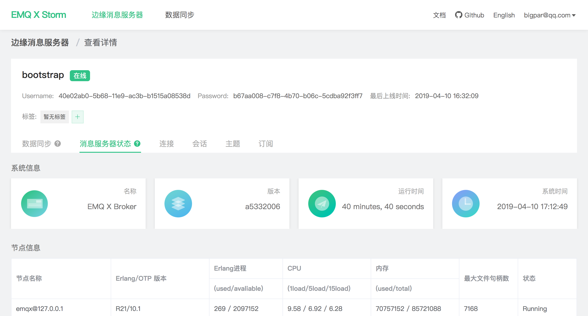

# Edge message server management

The  list of edge message servers under the current account  can be viewed through home page of edge message server:

- Total: Number of Edges created under the current account
- Activation: Number of Edges connected to the Storm platform
- Online: Number of Edges currently connected to the Storm platform
- Last online time: Last connection/disconnection time
- Operation: View details, edit, delete Edge server

Click on the Edge Message Server Name or View Details button in the list to enter the details page, which contains the following information:

- The authentication information of Username and password for the connection of Storm by Edge, please refer to [Quick connection](./connect_strom.md) for details.
- Label Management of current Edge Message Server  for batch management of Edge Collation
- Data Synchronization: [Data Synchronization](./bridge.md) configuration currently created

- Data Synchronization: [Data Synchronization] (./bridge.md) configuration currently created
- Running state:  displays real-time information when Edge Message Server is **online****, **and  shows the state of the most recent refresh when Edge Message Server is **offline**:
   - Message server status: Edge system information, CPU, memory information and messaging statistics of Erlang virtual machine , and so on.
   - Connections
   - Sessions
   - Topics
   - Subscriptions

