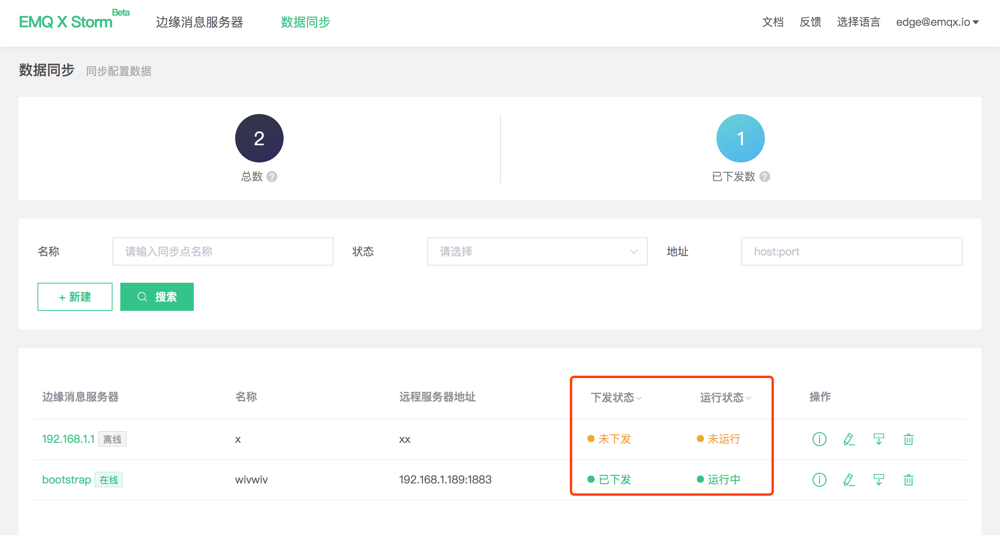
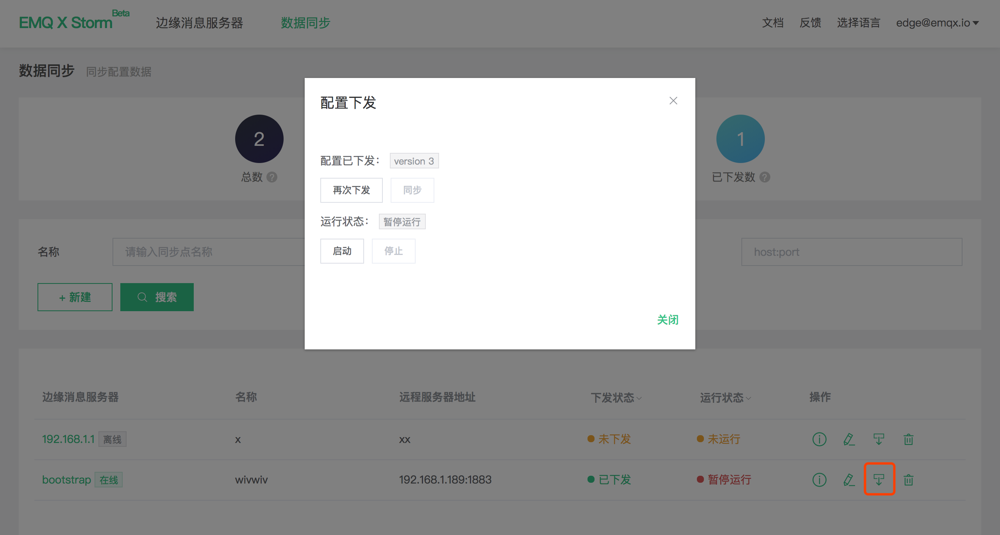

# 数据同步管理

数据同步用于配置数据同步规则，并将配置下发至边缘消息服务器。

数据同步主页可以查看当前账户下数据同步列表：

- 总数：当前账户下创建的数据同步数量
- 已下发数：已下发至 Edge 数据同步配置数

仅在 Edge 在线时可以下发数据同步配置，下发状态包括如下几类：

- 未下发：新建完毕没有下发成功过
- 已下发：下发成功，Edge 端配置与 Cube 保存的配置版本一致
- 有更新未下发：Cube 上更改过数据同步规则但未下发，两处版本不一致
- 下发失败：网络、参数配置等造成的配置下发失败

下发成功将立即在 Edge 端启动并运行数据同步，运行状态如下：

- 未运行：数据同步从未运行过
- 运行中：正常运行中
- 暂停运行：手动/故障导致暂定运行，Edge 端相关数据同步在故障/故障恢复后均会主动刷新 Cube 端运行状态

## 下发面板

点击表格操作列的**下发图标**弹出下发控制面板，可对所选数据同步配置进行下发。

- 

- 下发状态：显示当前运行状态(已下发/未下发/有更新未下发)与当前配置版本，每次更改配置后版本将自增 1

- 下发按钮：
  - 下发：初次下发到 Edge 端
  - 再次下发：Edge 端该配置不存在则创建并启用配置，存在则更新并重启应用配置，需慎用
  - 同步：Cube 上版本领先时可用，将最新配置更新到 Edge 端

- 运行控制：

  - 启动：启用当前配置
  - 停止：停用当前配置

  

