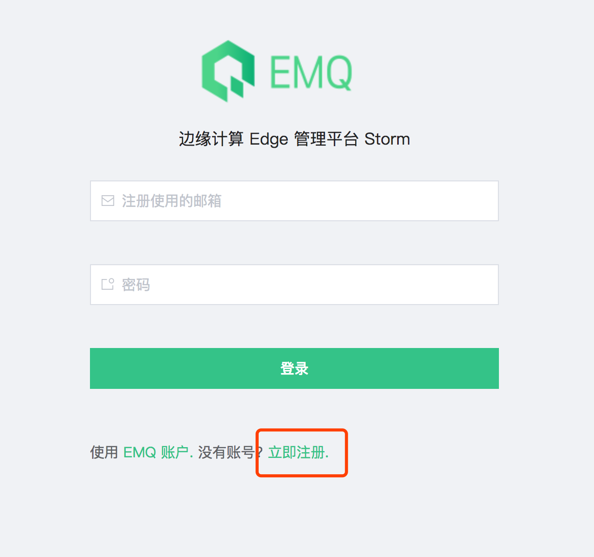
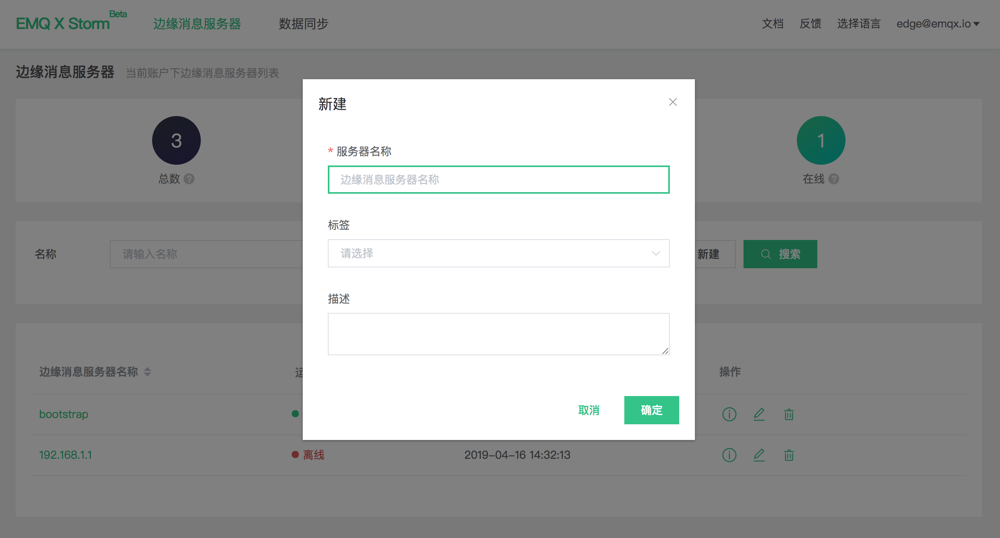
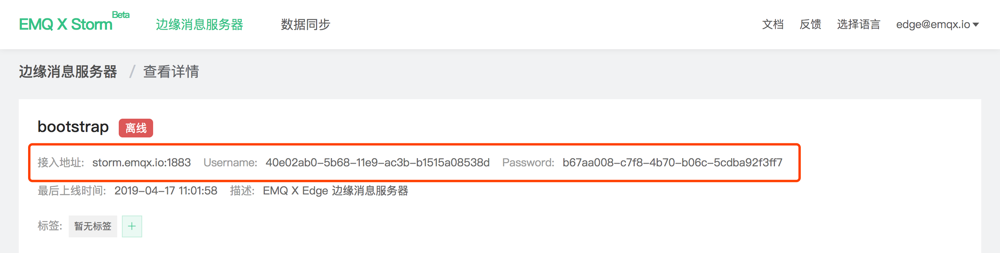
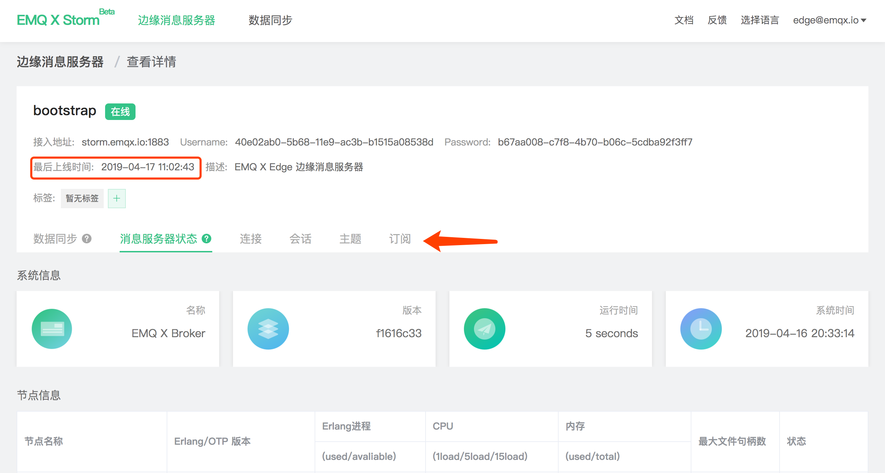

# 快速接入

## 准备

EMQ X Edge 通过 [emqx-cube ](http://github.com/emqx/emqx-cube]) 插件连接至 Cube 平台并进行管理指令通信，启用准备与操作步骤如下：

1. emqx-edge 版本大于等于 v3.1-rc.3 [点击下载](https://www.emqx.io/downloads/emq/edge?osType=Raspberry%20Pi#download)

2. Edge 所处网络环境能建立与 [cube.emqx.io:1883](cube.emqx.io:1883) 的通信连接

3. 注册 [EMQ 账号](https://www.emqx.io/account?tab=register) 并在 [Cube](https://cube.emqx.io) 中新建边缘消息服务器

4. Edge 上填入 Cube 中的配置，启动 emqx-cube 插件


> 注：Cube 仅做远程集中管理，是否启用 Cube 不影响 Edge 其他功能正常使用。


## 注册与登录

[Cube  开放平台](https://cube.emqx.io)使用 [EMQ 账号](https://www.emqx.io/account?tab=register) 认证登录，如果您没有在 EMQ 官网注册过账号，请前往注册激活。





## 新建边缘消息服务器

在**边缘消息服务器**页面，点击新建按钮键入服务器名称与描述创建边缘消息服务器




## 获取启动配置

新建边缘消息服务器后，可在边缘消息服务器**详情页**中获取接入 Cube 所需的信息：




打开 Edge emqx-cube 插件配置文件 `etc/plugins/emqx_storm.conf`，修改项如下：

```bash
# Cube 接入地址，默认 cube.emqx.io:1883
cube.address = cube.emqx.io:1883

# 认证用户名，使用详情中的 Username 信息
cube.username = 40e02ab0-5b68-11e9-ac3b-b1515a08538d

# 认证密码，使用详情中的 Password 信息
cube.password = b67aa008-c7f8-4b70-b06c-5cdba92f3ff7
```


## 启动并连接

如果配置正确，Edge 启动成功后将自动建立与 Cube 的连接，此时 Cube 中相关服务器状态将置为**在线**，点击切换相关 Tab 页即可获取对应运行指标。




至此，你已成功将 Edge 接入 Cube。

