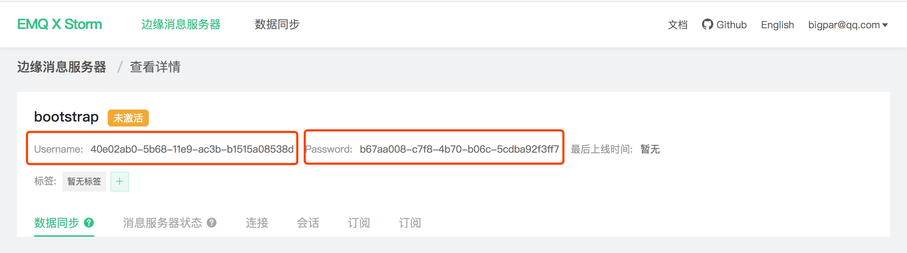
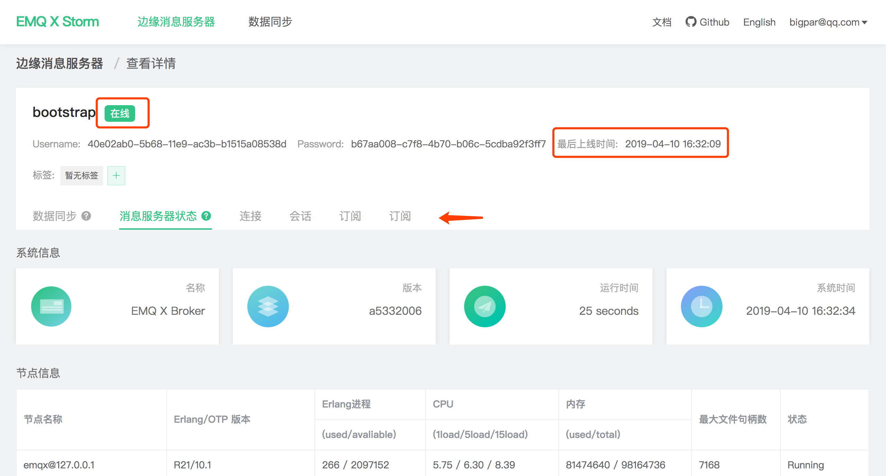

# 快速接入

EMQ X Edge 通过 [emqx-storm ](http://github.com/emqx/emqx-storm]) 插件连接至 Storm 平台并进行管理指令通信，启用前置条件如下：

- Edge 所处网络环境能建立与 [storm.emqx.io:1883](tcp://storm.emqx.io:1883) 的通信连接

- emqx-edge 版本大于等于 v3.1-rc.2

- 注册 [EMQ 账号](https://www.emqx.io/account) 并在 [Storm](https://storm.emqx.io) 中新建边缘消息服务器

- 配置 Edge emqx-storm 插件并启动 Edge

  

> 注：不接入 Storm 不会影响 Edge 其他功能正常使用。


## 配置接入信息

新建边缘消息服务器后，在边缘消息服务器**详情**中查看接入信息：




打开 Edge emqx-storm 插件配置文件 `etc/plugins/emqx_storm.conf`，修改项如下：

```bash
# Storm 接入地址，默认 storm.emqx.io:1883
storm.address = storm.emqx.io:1883

# 认证用户名，使用详情中的 Username 信息
storm.username = 40e02ab0-5b68-11e9-ac3b-b1515a08538d

# 认证密码，使用详情中的 Password 信息
storm.password = b67aa008-c7f8-4b70-b06c-5cdba92f3ff7
```


## 启动 Edge 消息服务器

Edge 启动成功后将自动建立与 Storm 的连接，此时 Storm 中相关服务器状态将置为**在线**，点击切换相关 Tab 页即可获取对应运行指标。




至此，你已成功将 Edge 接入 Storm。