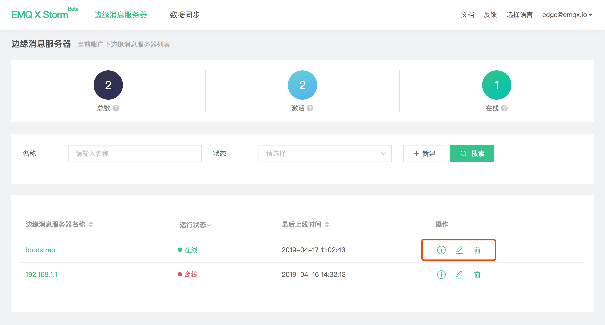
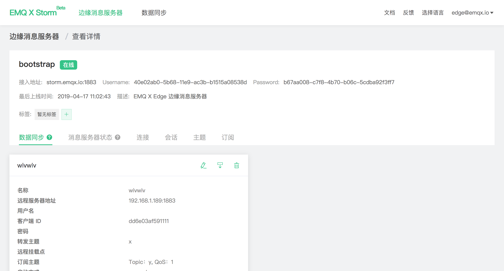

# 边缘消息服务器管理

边缘消息服务器主页可以查看当前账户下边缘消息服务器列表：

- 总数：当前账户下创建的 Edge 数量
- 激活：连接过 Cube 平台的 Edge 数量
- 在线：当前连接至 Cube 平台的 Edge 数量
- 最后上线时间：上一次连接/断开连接时间
- 操作：查看详情、编辑、删除 Edge 服务器

点击列表中的边缘消息服务器名称或查看详情按钮即可进入详情页，详情页包含信息如下：

- Edge 接入 Cube 接入信息 Address、Username 与 Password，使用方式详见 [快速接入](./connect_strom.md)
- 当前边缘消息服务器标签管理，用于批量管理归类 Edge
- 数据同步：当前已创建的 [数据同步](./bridge.md) 配置
- 运行状况，边缘消息服务器**在线**时显示实时信息，**离线**时显示最近一次刷新的状态：
  - 消息服务器状态：Edge 系统信息，Erlang 虚拟机 CPU 内存信息及消息收发统计等
  - 连接
  - 会话
  - 主题
  - 订阅

